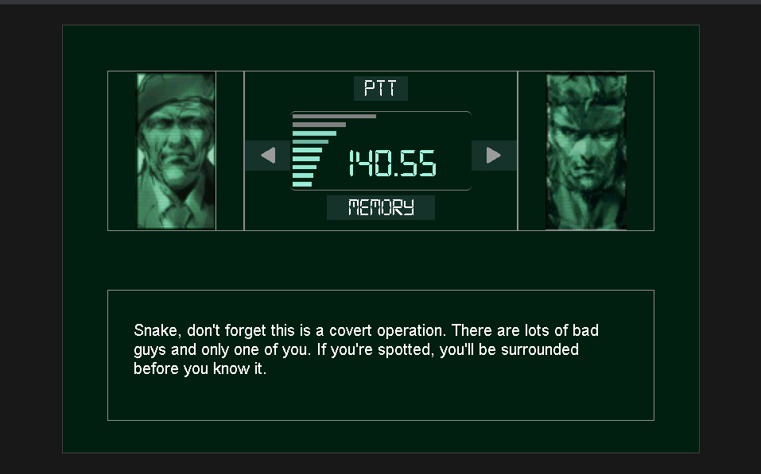

# metal-gear-solid-codec

Praticando css resolvei fazer o codec do metal gear solid 1, não esta responsivo, queria apenas deixa parecido e adicionar 
As linhas de texto caso a frequência do radio fosse a certa, exibindo assim a mensagem e mostrando a imagem do operador 
Também foi adicionado audio ao fazer a ligação, se a frequência for certa os degraus do volume alteram 

As frequência são 

140.40, Meryl Silverburgh 
140.55, Roy Campbell 
140.60", Nastasha Romanenko 

Para acessar basta clica em PTT na frequência certa 
Para instalar basta baixar os arquivos e npm install ou yarn add na pasta raiz depois yarn dev 

